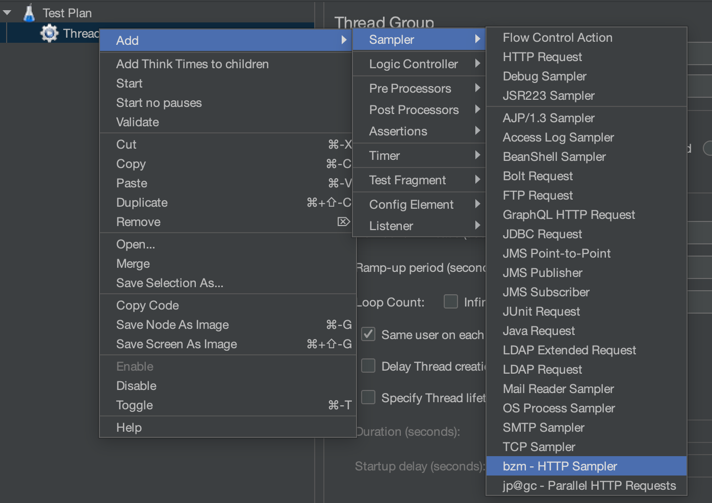
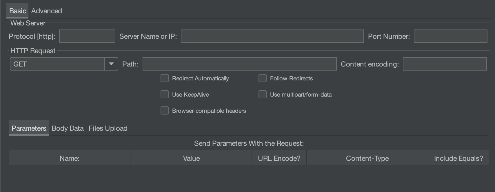
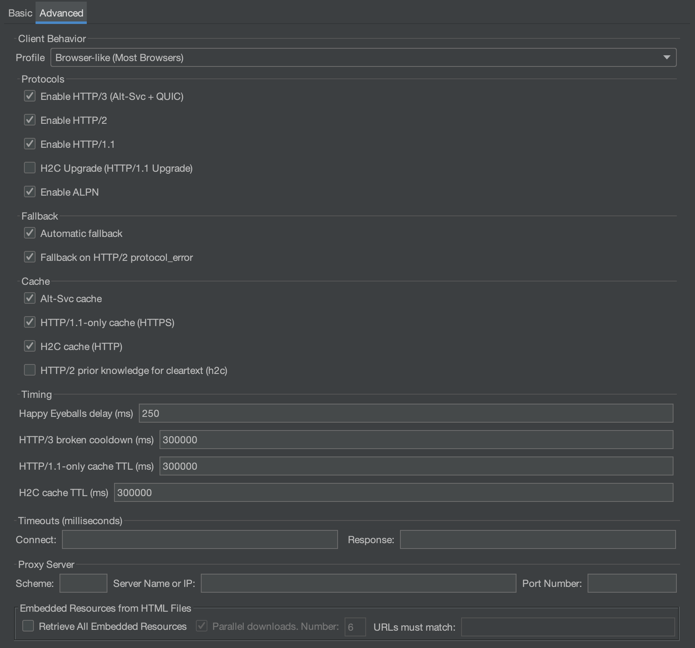
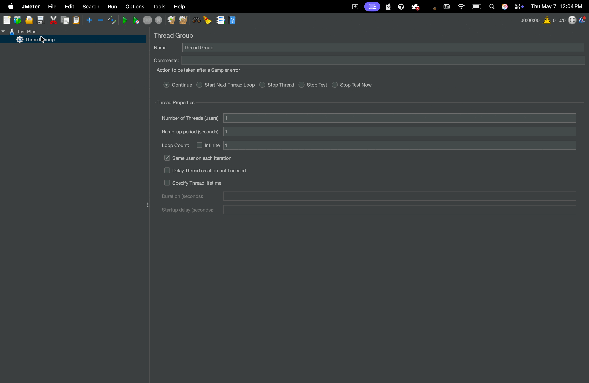
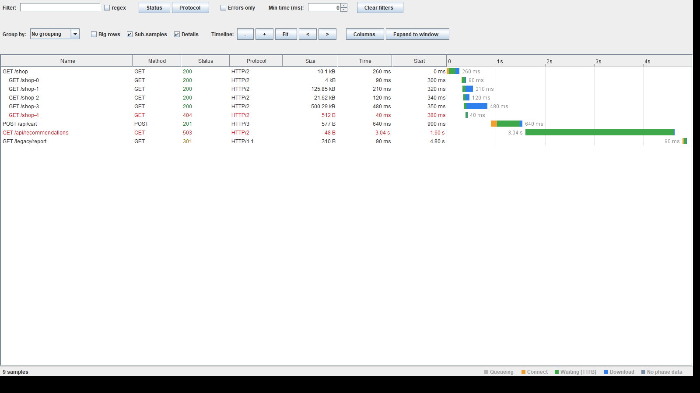

---
# BlazeMeter HTTP Plugin for JMeter (HTTP/1.1, HTTP/2, HTTP/3/QUIC)

---
<picture>
 <source media="(prefers-color-scheme: dark)" srcset="https://raw.githubusercontent.com/Blazemeter/jmeter-bzm-commons/refs/heads/master/src/main/resources/dark-theme/blazemeter-by-perforce-logo.png">
 
</picture>

This plugin provides a `bzm - HTTP Sampler` (multi-protocol: **HTTP/1.1**, **HTTP/2**, **HTTP/3 (QUIC)**) and **`bzm - HTTP Async Controller`** so multiple BlazeMeter HTTP samplers can run **overlapped in time** (concurrent sampler execution controlled by that controller—not the same thing as HTTP/2 stream multiplexing on the wire). If your test plan already uses JMeter’s standard **HTTP Request** sampler, you can **convert those elements to `bzm - HTTP Sampler`** in a few clicks—see **[Migrate from JMeter HTTP Request to BlazeMeter HTTP](#readme-migrate-jmeter-http-request)**.

> [!IMPORTANT]
> Requires **Java 17+**

> [!NOTE]
> **Compatibility:** Use **Java** and **Apache JMeter** versions that are **supported together** for the JMeter release you run. Through **JMeter 5.6.3**, JMeter does **not** support **Java** versions **newer than 21** — use **Java 17** or **Java 21** with those JMeter lines unless your vendor documents otherwise. For newer JMeter versions, follow Apache’s prerequisites in **[Getting Started](https://jmeter.apache.org/usermanual/get-started.html)** and the release notes for that version.

## Index

- [**Install**](#readme-install)
  - [Prerequisites](#readme-prerequisites)
  - [Installation using Plugins Manager](#readme-install-plugins-manager)
  - [Updating](#readme-updating)
  - [Manual installation](#readme-manual-installation)
  - [Verifying the installation](#readme-verifying-installation)
- [**Migrate from JMeter HTTP Request to BlazeMeter HTTP**](#readme-migrate-jmeter-http-request)
  - [When to use it](#readme-migrate-when)
  - [How to run migration](#readme-migrate-how)
- [**Creating the Test Plan**](#readme-creating-test-plan)
  - [Option A: Recording (JMeter HTTP(S) Test Script Recorder)](#readme-option-a-recording)
  - [Option B: Recording with BlazeMeter Automatic Correlation Recorder](#readme-option-b-correlation)
  - [Option C: Manual setup](#readme-option-c-manual)
- [**HTTP Sampler**](#readme-http-sampler)
  - [Basic tab](#readme-http-sampler-basic)
  - [Advanced tab](#readme-http-sampler-advanced)
    - [Client Behavior → Profile](#readme-client-profile)
    - [Client Behavior → Protocols / Fallback / Cache / Timing](#readme-client-protocols)
    - [Timeouts (milliseconds)](#readme-timeouts)
    - [Proxy Server](#readme-proxy-server)
    - [Embedded resources](#readme-embedded-resources)
  - [Protocols: how to use HTTP/1.1 vs HTTP/2 vs HTTP/3](#readme-protocols-howto)
  - [Buffer capacity](#readme-buffer-capacity)
  - [ALPN](#readme-alpn)
  - [Auth Manager](#readme-auth-manager)
  - [Multiplexing, HTTP/2, and overlapping sampler execution](#readme-multiplexing)
- [**HTTP Async Controller**](#readme-http-async-controller)
  - [Controller panel](#readme-http-async-panel)
- [**Waterfall Viewer**](#readme-waterfall-viewer)
  - [Reading the bars](#readme-waterfall-bars)
  - [The details panel](#readme-waterfall-details)
  - [Live runs and .jtl files](#readme-waterfall-sources)
  - [The expanded window](#readme-waterfall-expanded)
- [**JMeter property reference**](#readme-jmeter-property-reference)
- [**Logging and low-level debugging**](#readme-logging)
  - [Keeping Jetty's own logging out of it](#readme-logging-jetty-verbosity)
- [**Building from source**](#readme-building-from-source)
- [**License**](#readme-license)


<a id="readme-install"></a>

<a id="readme-prerequisites"></a>
## Prerequisites

1. **[Apache JMeter](https://jmeter.apache.org/download_jmeter.cgi)** installed and runnable with a **Java** version that matches that JMeter release (see the **Important** / **Note** alerts at the top of this README).
2. **[JMeter Plugins Manager](https://www.blazemeter.com/blog/how-install-jmeter-plugins-manager)** installed inside JMeter. Plugins Manager is the usual way to add and update community plugins such as this one.

> [!NOTE]
> Install this plugin via **Plugins Manager** when possible. Start from the prerequisites, then install, verify, and update as needed.


<a id="readme-install-plugins-manager"></a>
## Installation using Plugins Manager

1. Start **JMeter** and open **Plugins Manager** (typically **Options → Plugins Manager** depending on your JMeter build).
2. Open the **Available Plugins** tab and search for **BlazeMeter HTTP**.
3. Select it, click **Apply Changes and Restart JMeter**, and wait for the install to finish.


<a id="readme-updating"></a>
## Updating

If the plugin is already installed, open **Plugins Manager → Installed Plugins**, find the same entry, and install updates when offered (then restart JMeter when prompted), same as other Plugins Manager extensions.


<a id="readme-manual-installation"></a>
## Manual installation

Use this path when Plugins Manager is not an option—for example offline installs.

1. Open **[Releases](https://github.com/Blazemeter/jmeter-http2-plugin/releases)** for this repository and choose the plugin version that matches your JMeter line (the **Latest** tag is usually the right default).
2. Under **Assets** for that release, download **`jmeter-bzm-http2-<version>.jar`**.
3. Copy **`jmeter-bzm-http2-<version>.jar`** into **`<JMETER_HOME>/lib/ext`**.
4. **Restart JMeter**.


<a id="readme-verifying-installation"></a>
## Verifying the installation

1. In **Plugins Manager → Installed Plugins**, confirm the BlazeMeter HTTP plugin is listed.
2. In a test plan: **Add → Sampler** and check that **`bzm - HTTP Sampler`** is available. Optionally **Add → Logic Controller** and verify **`bzm - HTTP Async Controller`**.

To build the JAR yourself from this repository, see **[Building from source](#readme-building-from-source)** below.


<a id="readme-migrate-jmeter-http-request"></a>
## Migrate from JMeter HTTP Request to BlazeMeter HTTP

If your plan uses Apache JMeter’s standard **HTTP Request** sampler, convert those elements to **`bzm - HTTP Sampler`** to use **HTTP/1.1**, **HTTP/2**, and **HTTP/3** from this plugin. 

The tool replaces **HTTP Request → BlazeMeter HTTP** in the test tree.


<a id="readme-migrate-when"></a>
### When to use it

Use this path when:

- Your `.jmx` drives HTTP traffic with JMeter’s stock **HTTP Request** sampler (tree label **HTTP Request**; element type `HTTPSamplerProxy`, or legacy `HTTPSampler` on very old plans).
- You want **`bzm - HTTP Sampler`** and its multi-protocol client (**HTTP/1.1**, **HTTP/2**, **HTTP/3**, profiles, Jetty behavior) **without** manually re-adding every request.
- You are **not** starting from a blank plan (for that, see [Creating the Test Plan](#readme-creating-test-plan) below).


<a id="readme-migrate-how"></a>
### How to run migration

Open **Tools → BlazeMeter HTTP** and choose one of:

| Menu item | Behavior |
|-----------|----------|
| **Migrate Entire Test Plan (HTTP Request → BlazeMeter HTTP)…** | Scans the whole tree and replaces every migratable **HTTP Request** sampler after confirmation. |
| **Migrate Selected (HTTP Request → BlazeMeter HTTP)…** | Replaces only selected tree nodes that qualify; non-HTTP selections are listed as skipped in the confirm dialog. |

**Recommended flow:**

1. [Install and verify](#readme-verifying-installation) the plugin.
2. Open your `.jmx` in JMeter (**stop any running test** before migrating).
3. **Save a backup** of the test plan—migration **cannot be undone**.
4. **Tools → BlazeMeter HTTP →** run **Migrate Entire Test Plan…** or **Migrate Selected…**.
5. Confirm the sampler count in the dialog.
6. Review migrated **`bzm - HTTP Sampler`** nodes; tune **Advanced → Client Behavior** (profiles, HTTP/2, HTTP/3) as needed.
7. Save the updated `.jmx`.

> [!NOTE] **Preserved during migration:**
>
> - **Sampler settings** from the original HTTP Request (URL, method, body, timeouts, redirects, etc.)—properties are copied; only the GUI/test class names change to BlazeMeter HTTP.
> - **Child elements** under each HTTP Request (assertions, timers, preprocessors, etc.)—they stay attached under the new sampler.
> - **Tree position**—same parent and index in the test plan.
> - **Selection**—after a batch migration, tree selection is restored to the new nodes where possible.

<a id="readme-creating-test-plan"></a>
# Creating the Test Plan

> **Already using JMeter’s standard HTTP Request sampler?** **[Migrate from JMeter HTTP Request to BlazeMeter HTTP](#readme-migrate-jmeter-http-request)**.  
> **No script yet?** Pick an option below.

<a id="readme-option-a-recording"></a>
### Option A: Recording (JMeter HTTP(S) Test Script Recorder)

This plugin can act as a sampler creator during JMeter proxy recording; it is **enabled by default**.

1. Use JMeter’s [**HTTP(S) Test Script Recorder**](https://jmeter.apache.org/usermanual/jmeter_proxy_step_by_step.html) as usual.

2. As the elements are recorded, the plugin creates the BlazeMeter HTTP Sampler automatically.

> [!NOTE]
>
> To disable recording support, use **Tools → BlazeMeter HTTP → Disable Recording with HTTP(S) Test Script Recorder** (restart when prompted).
> You can also set `blazemeter.http.proxy_enabled=false` in `user.properties` (legacy `HTTP2Sampler.proxy_enabled` is accepted too).
> The recorder creates `bzm - HTTP Sampler` elements, but you may still want to adjust protocol/profile settings afterwards.


<a id="readme-option-b-correlation"></a>
### Option B: Recording with BlazeMeter Automatic Correlation Recorder

This plugin is also compatible with the BlazeMeter Automatic Correlation Recorder recording method.

For more information: [BlazeMeter Automatic Correlation Recorder - Installing the Plugin](https://blazemeter.github.io/CorrelationRecorder/guide/installation-guide.html#prerequisites)

> [!NOTE]
>
> Since BlazeMeter Automatic Correlation Recorder inherits and is compatible with the JMeter recorder, the process of enabling and disabling Recording support is the same as the method documented in Option A.


<a id="readme-option-c-manual"></a>
### Option C: Manual setup

1. Create a Thread Group.

2. Add the HTTP Sampler (Add → Sampler → bzm - HTTP Sampler).



3. Configure the sampler URL + client behavior (profile/protocols) as described below.
4. Add timers, assertions, listeners, etc.

> [!NOTE]
> Where possible the sampler aligns with behaviors you know from JMeter’s **HTTP Request**. There are deliberate differences wherever multi-protocol negotiation, QUIC, or the Jetty client requires them.

<a id="readme-http-sampler"></a>
# HTTP Sampler

The sampler UI has two tabs: **Basic** (URL + request basics) and **Advanced** (client behavior + timeouts/proxy/embedded resources).

<a id="readme-http-sampler-basic"></a>
### Basic tab



This is the standard JMeter URL configuration panel (domain, port, path, method, redirects, body, etc.).

| **Field** | **Description** | **Default** |
|---|---|---|
| Protocol | `http` or `https` (URL scheme). This is independent from HTTP/1.1 vs HTTP/2 vs HTTP/3 negotiation. | `http` |
| Server name or IP | Target host (no `http://` prefix). | |
| Port number | Target port. | `80` for http, `443` for https |
| Method | Standard HTTP methods supported by JMeter. | `GET` |
| Path | Path + query (e.g. `/api/v1/items?limit=10`). | `/` |
| Content encoding | Character encoding used for request body (unrelated to HTTP `Content-Encoding` header). | |
| Redirect Automatically / Follow Redirects | Same semantics as JMeter’s HTTP Request sampler. | |
| Use KeepAlive | Reuse connections when possible (same semantics as JMeter’s HTTP Request sampler). | |
| Browser-compatible headers | Add headers that mimic common browser behavior (same semantics as JMeter’s HTTP Request sampler). | |
| Use multipart/form-data | Same semantics as JMeter’s HTTP Request sampler. | |


<a id="readme-http-sampler-advanced"></a>
### Advanced tab




<a id="readme-client-profile"></a>
#### Client Behavior → Profile

A **profile** is a named bundle of protocol defaults (which protocols are enabled, whether ALPN is enabled, fallback/caches, and timings). Profiles make it easy to mimic “how browsers behave” vs “legacy compatibility”.

The available profiles are:

- **Browser-like (Most Browsers)** (`browser-like`) (default)
- **Browser-compatible (Other Browsers)** (`browser-compatible`)
- **Legacy / Older Systems** (`legacy`)
- **Browser-like (Custom)** (`browser-like-custom`) (persists per-sampler toggles below)


<a id="readme-client-protocols"></a>
#### Client Behavior → Protocols / Fallback / Cache / Timing

| **Control** | **What it does** |
|---|---|
| Enable HTTP/3 (Alt-Svc + QUIC) | Allows HTTP/3 when the origin advertises it via `Alt-Svc`. Typically requires `https` and UDP/QUIC reachability. |
| Enable HTTP/2 | Allows HTTP/2. Over TLS this is typically negotiated via ALPN. For cleartext origins see H2C options below. |
| Enable HTTP/1.1 | Allows HTTP/1.1. If disabled, the client will avoid HTTP/1.1 unless forced by server/proxy constraints. |
| H2C Upgrade (HTTP/1.1 Upgrade) | For cleartext (`http://`) origins, allow HTTP/1.1 → HTTP/2 (h2c) upgrade. Visible when HTTP/1.1 and HTTP/2 are enabled. |
| Enable ALPN | Enables TLS ALPN for **HTTPS** (**HTTP/1.1** and **HTTP/2**). (**HTTP/3 discovery** uses **Alt-Svc**, not ALPN.) Cleartext **h2c** uses upgrade/prior-knowledge flows instead of TLS ALPN. |
| Automatic fallback | Enables automatic fallback between protocols (e.g. prefer HTTP/3, then fall back to HTTP/2/1.1 as needed). |
| Fallback on HTTP/2 protocol_error | If an HTTP/2 `protocol_error` occurs, retry using HTTP/1.1 (when fallback is enabled). |
| Alt-Svc cache | Caches `Alt-Svc` advertisements used for HTTP/3 discovery. |
| HTTP/1.1-only cache (HTTPS) | Caches “this HTTPS origin should be treated as HTTP/1.1-only” after failures, to avoid repeated negotiation overhead. |
| H2C cache (HTTP) | Caches h2c capability for cleartext origins. |
| HTTP/2 prior knowledge for cleartext (h2c) | Forces HTTP/2 prior knowledge (h2c) for cleartext origins, skipping the upgrade dance. Use only if you know the server speaks h2c. |
| Happy Eyeballs delay (ms) | When trying HTTP/3, delay before starting HTTP/2 in parallel (H3+H2) to reduce latency while avoiding extra connections. |
| HTTP/3 broken cooldown (ms) | How long to consider HTTP/3 “broken” for an origin after failures before retrying. |
| HTTP/1.1-only cache TTL (ms) | How long to keep the “HTTP/1.1-only” decision for an HTTPS origin. |
| H2C cache TTL (ms) | How long to keep the “h2c supported” decision for a cleartext origin. |


<a id="readme-timeouts"></a>
#### Timeouts (milliseconds)

| **Field** | **Description** |
|---|---|
| Connect | Milliseconds to wait for a connection to open. |
| Response | Milliseconds to wait for a response. |


<a id="readme-proxy-server"></a>
#### Proxy Server

| **Field** | **Description** |
|---|---|
| Scheme | Proxy scheme (typically `http`). |
| Server name or IP | Proxy host. |
| Port Number | Proxy port. |


<a id="readme-embedded-resources"></a>
#### Embedded resources

| **Field** | **Description** |
|---|---|
| Retrieve All Embedded Resources | Parses HTML and downloads embedded resources (images, JS, CSS, etc.). |
| Parallel downloads | When enabled, embedded resources are fetched concurrently; “pool size = 1” forces synchronous behavior. |
| URLs must match | Regex filter for which embedded resources to download. |


<a id="readme-protocols-howto"></a>
### Protocols: how to use HTTP/1.1 vs HTTP/2 vs HTTP/3

The simplest way is to pick a profile and only override when you need a specific behavior.

Common configurations:

- **Prefer HTTP/3, fallback to HTTP/2/1.1**: profile `browser-like` (default). Ensure **Enable HTTP/3** and **Automatic fallback** are enabled.
- **HTTP/2-only (TLS)**: disable **Enable HTTP/1.1**, disable **Enable HTTP/3**, keep **Enable HTTP/2** enabled. (For `https://` origins, ALPN typically must be enabled.)
- **HTTP/1.1-only**: keep **Enable HTTP/1.1** enabled, disable HTTP/2 and HTTP/3.
- **Cleartext h2c (upgrade)**: use `http://` scheme, enable HTTP/1.1 + HTTP/2, and enable **H2C Upgrade**.
- **Cleartext h2c (prior knowledge)**: use `http://` scheme, enable HTTP/2, enable **HTTP/2 prior knowledge for cleartext (h2c)** (only if the server supports it).

> [!NOTE]
>
> HTTP/3 is **discovered via Alt-Svc** (and optionally cached), not via ALPN.


<a id="readme-buffer-capacity"></a>
### Buffer capacity / response store truncation

By default there is no store cap (`blazemeter.http.maxBufferSize` unset → effective **`-1`**): Jetty buffers without a hard fail (unlike Jetty’s own `BufferingResponseListener` 2 MiB default), and the full decoded body is kept in the sample.

When a positive limit applies, behaviour matches Apache JMeter’s
`httpsampler.max_bytes_to_store_per_request`: the sample stays **successful**, only the first N
bytes are stored in response data, `bodySize` reflects the full decoded length, and JMeter logs
`Big response, truncating it to {} bytes` at **DEBUG**. Truncation is skipped while recording.

**Precedence** (first match wins):

1. Plugin `blazemeter.http.maxBufferSize` (aliases `HTTP2Sampler.maxBufferSize` /
   `httpJettyClient.maxBufferSize`) if set
2. Else JMeter `httpsampler.max_bytes_to_store_per_request` if set
3. Else `-1` (no truncation)

`<= 0` means do not truncate.


<a id="readme-alpn"></a>
### ALPN

The plugin uses **TLS ALPN** so HTTPS connections can advertise **HTTP/1.1** and **HTTP/2** (`h2`). **HTTP/3 discovery** is separate—it relies on **`Alt-Svc`** (see **Protocols** above), not TLS ALPN.

Cleartext **h2c** never uses TLS ALPN; negotiation uses **HTTP/1.1 Upgrade** or **prior knowledge**, matching the **`http://`** options described elsewhere in this README.

For TLS keystores/truststores, see JMeter’s [SSL Manager](https://jmeter.apache.org/usermanual/component_reference.html#SSL_Manager) and [Keystore Configuration](https://jmeter.apache.org/usermanual/component_reference.html#Keystore_Configuration).


<a id="readme-auth-manager"></a>
### Auth Manager

Currently, we only support the Basic and Digest authentication mechanisms.

To use Basic preemptive authentication, set `blazemeter.http.auth.preemptive` to **`true`** in **`jmeter.properties`** or **`user.properties`**.


<a id="readme-multiplexing"></a>
### Multiplexing, HTTP/2, and overlapping sampler execution

**HTTP/2 multiplexing** means many requests can share **one TLS/TCP connection** as separate streams—the Jetty stack does this whenever negotiation selects HTTP/2.

**Overlapping sampler execution** (several BlazeMeter HTTP samplers in progress at once **within one thread iteration**) requires **`bzm - HTTP Async Controller`**. The concurrent cap follows **`blazemeter.http.maxConcurrentAsyncInController`** (default **100**) whenever **Limit max number of parallel executions** is unchecked. When limiting is checked, saves persist **Max parallel** as **`blazemeter.http.controller.maxConcurrentAsyncInController`**; unchecking restores the global cap at runtime whether or not stale values linger in the saved plan—see **[HTTP Async Controller](#readme-http-async-controller)** and **[Controller panel](#readme-http-async-panel)**. Tune **`blazemeter.http.maxRequestsPerConnection`** (default **100**) for Jetty concurrency per pooled connection.

> [!IMPORTANT]
> Outside **`bzm - HTTP Async Controller`**, a Thread Group still runs BlazeMeter HTTP samplers **one after another** (the sampler returns before JMeter proceeds). That sequential **test-plan** pacing is orthogonal to HTTP/2 **transport** multiplexing.


<a id="readme-http-async-controller"></a>
# HTTP Async Controller

Add it with **Add → Logic Controller → bzm - HTTP Async Controller**. **`bzm - HTTP Sampler`** nodes that sit **directly under** this logic controller start their HTTP calls **without blocking each other**, so several requests can be **in flight at once within the same thread iteration**, up to the concurrency cap (**[Multiplexing, HTTP/2, and overlapping sampler execution](#readme-multiplexing)** and **[Controller panel](#readme-http-async-panel)** below).




<a id="readme-http-async-panel"></a>

| **Field** | **Description** | **Default** |
|---|---|---|
| Generate Parent Sample | Wraps child BlazeMeter HTTP results in one parent sample (sub-results in listeners/reports). | Off (`false`) |
| Include duration of timer and pre-post processors in generated sample | Only applies with **Generate Parent Sample** on. When **off**, the parent sample measures the requests only: from the first one sent to the last response received, so think times and pre/post-processor time are reported as idle time instead of transaction time. When **on**, the parent sample spans the whole controller, pauses included (JMeter's Transaction Controller behaviour). | Off (`false`) |
| Limit max number of parallel executions | When **off**, the cap is **`blazemeter.http.maxConcurrentAsyncInController`**. When **on**, cap is **Max parallel** (saved in the `.jmx` only while this is on; runtime still uses the global cap when off). | Off (`false`) |
| Max parallel | Highest number of overlapping BlazeMeter HTTP samplers when limiting is **on** (integer ≥ **1**). Read-only when limiting is **off** (shows the effective global cap). | **100** (matches **`blazemeter.http.maxConcurrentAsyncInController`** unless you override; with limiting **on**, use the value you enter) |

In **View Results Tree**, rows may follow **completion order**, not test-plan order.

> [!NOTE]
> Anything else you add as a **direct child**—timers, a different sampler type, an assertion, another controller, etc.—still runs **in tree order**. Before that element runs, the controller **waits until every BlazeMeter HTTP request started above it has completed**. Use that pattern when you mean “kick off these BlazeMeter HTTP calls together, then run the following steps only after they are all done.”

> [!NOTE]
> **When a Thread Group runs for a duration**, the requests this controller had already sent when the time ran out are still collected and reported, the same way JMeter lets a running request finish before it stops a thread. Nothing new is dispatched once the time is up, so no load reaches the system under test past the end of the run; the thread ends as soon as the responses it was already waiting for arrive. Tune or disable that grace with **`blazemeter.http.schedulerHoldMillis`**. A **Stop** is immediate and is never held off.


<a id="readme-waterfall-viewer"></a>
# Waterfall Viewer

Add it with **Add → Listener → bzm - Waterfall Viewer**. It draws a run the way a browser's Network
panel draws a page load: a table of samples on the left, a time-aligned waterfall of coloured phase
bars on the right, and a DevTools-style details panel for whichever request you click.

It is the listener to reach for when the question is *why was this slow* rather than *what did this
return* — and it keeps what **View Results Tree** gives you for the second question too.

Works with **HTTP/1.0, HTTP/1.1, HTTP/2 and HTTP/3**, and with any other sampler as well: a
`SampleResult` needs only a **start time and an elapsed time** to get a bar. JDBC, JMS, gRPC,
GraphQL and JSR223 samples all appear. Connect time, latency, protocol, headers and body are
enrichment — present when the sampler reports them, and explicitly reported as missing when not.

📖 **[Full guide: docs/waterfall-viewer.md](docs/waterfall-viewer.md)**



<a id="readme-waterfall-bars"></a>
### Reading the bars

Each bar spans the sample's real wall-clock extent on a shared time axis, split into the phases in
the order they happen:

| Colour | Phase | Source |
|---|---|---|
| ⬜ Grey | **Queueing / Idle** | `idleTime` — wall-clock time the sample did not measure, such as the pauses between a transaction controller's children |
| 🟧 Orange | **Connect** | `connectTime`. Absent on a reused connection. On HTTPS this includes the TLS handshake |
| 🟩 Green | **Waiting (TTFB)** | `latency − connectTime` — the server thinking |
| 🟦 Blue | **Content Download** | `elapsed − latency` — reading the body off the wire |
| ▪ Slate | **No phase data** | The whole elapsed time as one segment, for a sample that reported neither connect time nor latency |

Columns are **Name, Method, Status** (coloured by status class)**, Protocol, Type, Size, Time, Start**
(relative)**, Thread** and the waterfall itself; hover a bar for a tooltip carrying the full phase
breakdown.

> [!NOTE]
> These are exactly the phases JMeter measures, and no others. There is **no separate SSL/TLS
> phase**: `SampleResult.connectTime` is the whole connection setup with the handshake inside it,
> there is no API to ask for the handshake alone, and no JTL column carries it. A browser can draw a
> purple TLS band because it instrumented its own socket; JMeter does not report that number, so the
> viewer does not draw a band for it. The Timing tab labels the connect row *Connect (TLS handshake
> included)* on a secure request.

<a id="readme-waterfall-details"></a>
### The details panel

Click a row and four tabs describe that sample. The split between them is a division of labour with
JMeter: **Response** is JMeter's own machinery, and the other three are what a waterfall needs that
View Results Tree has no equivalent for. Only the visible tab does any work.

| Tab | What it holds |
|---|---|
| **Response** | View Results Tree's right-hand side, hosted here: the same **Render:** selector over every renderer this JMeter has, and the renderer's own *Sampler result / Request / Response data* tabs |
| **Headers** | A **General** section (URL, method, status, protocol, sizes), then request and response headers together, with one filter box that narrows all three and per-block copy buttons |
| **Timing** | Every reported phase as a stacked bar plus a table of durations and shares, absolute start and finish, and **Copy timing** |
| **Cookies** | Request cookies (from the Cookie Manager field or the `Cookie` header), and response cookies split into Name, Value, Domain, Path, Expires, Max-Age, HttpOnly, Secure, SameSite |

> [!IMPORTANT]
> **Nothing in the Response tab looks at a content type itself.** How to present a response body is
> a problem JMeter already solved, dynamically and extensibly, through its `ResultRenderer`
> interface — HTML, JSON, XML, images, the extractor testers, `RenderAsDocument` running the bytes
> through Apache Tika so a PDF or a Word response comes out as text, and whatever renderer a
> third-party plugin dropped into `lib/ext`. Renderers are discovered exactly as View Results Tree
> discovers them and ordered by the same `view.results.tree.renderers_order` property, so this tab
> behaves identically and gains whatever a future JMeter release adds. Reimplementing that MIME
> handling here would have produced a second, worse copy that drifts at every JMeter release.

<a id="readme-waterfall-sources"></a>
### Live runs and .jtl files

**Live:** rows appear as samples complete. Samples are queued on the sampler threads and drained
into the table four times a second in bounded batches — a listener must never make a test thread wait
on the UI, or it distorts the numbers it is reporting. While you have not zoomed, the axis follows
the growing run; once you zoom, the view stays put.

**From a file:** use the listener's own **Write results to file / Read from file** panel to browse to
a `.jtl`. Both CSV and XML are read, including files from a non-GUI run, and parsing happens on a
background thread so a large file does not freeze JMeter.

To get a full waterfall out of `jmeter -n -l results.jtl`, the run has to save the columns the
viewer draws with — `connect_time`, `latency`, `idle_time`, and for the protocol and the details
panel an XML file with the header and data columns on. Two caveats worth knowing:

- **`sampleresult.timestamp.start` must be `true`** (JMeter's own default in `jmeter.properties`, but
  the built-in fallback is `false`). Whether a JTL's `timeStamp` is the *start* or the *end* of a
  sample is decided by this property in the JMeter **reading** the file. Get it wrong and every bar
  is offset by its own duration — internally consistent, and quietly wrong.
- **A CSV `.jtl` carries no URL and no protocol.** JMeter's CSV reader writes the URL column and then
  skips it on the way back in, and the protocol lives in the response status line, which CSV has no
  column for. Use `output_format=xml` when you need either.

Full property list and the reasoning behind each limitation:
**[docs/waterfall-viewer.md](docs/waterfall-viewer.md)**.

<a id="readme-waterfall-expanded"></a>
### The expanded window

A waterfall is only as useful as it is wide — a bar three pixels across cannot say which phase
dominated it — and JMeter's listener panel is a fraction of a screen with the test plan tree beside
it. So the view has two modes:

- **Embedded (mini):** inside the listener panel, for a glance while a test runs.
- **Expanded:** **Expand to window** opens it in a **maximised window of its own**, which is where
  the analysis is meant to happen. **F11** toggles fullscreen, **Escape** leaves it, and **Return to
  panel** (or closing the window) puts it back.

Expanding **moves** the view rather than cloning it: same samples, same filters, same zoom, same
selection either way, so switching never loses what you were reading. The listener panel shows a
note while the window is open, so it is never unclear where the data went.

Filters cover label or URL (substring or regex), status class, protocol, minimum elapsed time and
errors-only; rows can be grouped into collapsible headings by **Thread Group** or **Label**; the
timeline zooms with **Ctrl + wheel** over the bars, pans with **Shift + wheel**, and zooms to a
dragged range on the ruler.

> [!NOTE]
> Each row keeps a reference to its `SampleResult` so the details panel can show bodies, which makes
> retention the viewer's memory ceiling. The oldest samples are evicted past
> **`blazemeter.waterfall.maxSamples`** (default **50 000**) and the status line reports how many
> were dropped, so a partial timeline never looks complete. For a very long run, write a `.jtl`
> during the test and open that afterwards.


<a id="readme-jmeter-property-reference"></a>
# JMeter property reference

Restart JMeter after changing JMeter properties that are applied when affected classes initialize.

The diagnostic switches are **not** in this table: `blazemeter.http.lowLevelLog` is read as a JVM system property, not as a JMeter property — see **[Logging and low-level debugging](#readme-logging)**.

| **Attribute** | **Description** | **Default** |
|---|---|---:|
| **blazemeter.http.proxy_enabled** | When **`true`**, the HTTP(S) Test Script Recorder creates **`bzm - HTTP Sampler`** instead of stock **HTTP Request** (legacy `HTTP2Sampler.proxy_enabled` accepted) | true |
| **blazemeter.http.maxBufferSize** | Max bytes stored in sample response data (`<=0` / unset default path = no truncation). Overrides JMeter store limit when set | -1 |
| **blazemeter.http.minThreads** | Minimum number of threads per HTTP client | 1 |
| **blazemeter.http.maxThreads** | Maximum number of threads per HTTP client | 5 |
| **blazemeter.http.maxRequestsQueuedPerDestination** | Maximum number of requests that may be queued to a destination | 32767 |
| **blazemeter.http.maxConnectionsPerDestination** | Sets the maximum number of connections to open to each destination | 100 |
| **blazemeter.http.byteBufferPoolFactor** | Factor applied when allocating buffers for the HTTP client | 4 |
| **blazemeter.http.strictEventOrdering** | Force request events ordering | false |
| **blazemeter.http.sharedThreadPool** | Use a shared thread pool across HTTP clients | false |
| **blazemeter.http.idleTimeout** | Max time, in milliseconds, a connection can be idle | 60000 |
| **blazemeter.http.removeIdleDestinations** | When **`false`**, disables destination idle timeout (client keeps destinations without expiring them due to idleness) | true |
| **blazemeter.http.auth.preemptive** | Use of Basic preemptive authentication results | false |
| **blazemeter.http.maxConcurrentPushedStreams** | Maximum number of server push streams concurrently received | 100 |
| **blazemeter.http.maxRequestsPerConnection** | Maximum Jetty HTTP requests per pooled connection | 100 |
| **blazemeter.http.maxConcurrentAsyncInController** | Default concurrency cap inside **`bzm - HTTP Async Controller`** when parallel limiting is unchecked | 100 |
| **blazemeter.http.schedulerHoldMillis** | How far **`bzm - HTTP Async Controller`** may push a thread's scheduled end while its requests are still on the wire, so a duration-limited run collects the responses it already asked for instead of dropping them. Renewed while requests are pending and given back as soon as they are collected; a Stop is never held off. Set to **0** to let the schedule cut mid-flight | 2000 |
| **HTTPSampler.response_timeout** | Default response timeout (ms) when the sampler defines none | 0 |
| **http.post_add_content_type_if_missing** | Add Content-Type header if missing? | false |
| **blazemeter.http.enableHttp3** | Enable HTTP/3 support (Alt-Svc + QUIC) | profile |
| **blazemeter.http.enableHttp2** | Enable HTTP/2 support | profile |
| **blazemeter.http.enableHttp1** | Enable HTTP/1.1 support | profile |
| **blazemeter.http.alpnEnabled** | Enable ALPN | profile |
| **blazemeter.http.fallbackEnabled** | Enable automatic fallback between protocols | profile |
| **blazemeter.http.protocolErrorFallbackEnabled** | Enable fallback to HTTP/1.1 for HTTP/2 protocol_error | profile |
| **blazemeter.http.disableFallback** | Legacy flag (inverse of protocolErrorFallbackEnabled) | false |
| **blazemeter.http.goawayRetryEnabled** | Enable retry on HTTP/2 GOAWAY | true |
| **blazemeter.http.maxGoawayRetries** | Max retries on GOAWAY before fallback | 1 |
| **blazemeter.http.altSvcCacheEnabled** | Enable Alt-Svc cache for HTTP/3 discovery | profile |
| **blazemeter.http.http1OnlyCacheEnabled** | Enable HTTP/1.1-only cache for HTTPS origins | profile |
| **blazemeter.http.h2cCacheEnabled** | Enable H2C cache for cleartext origins | profile |
| **blazemeter.http.h2cUpgradeEnabled** | Enable **H2C Upgrade (HTTP/1.1 Upgrade)** | false |
| **blazemeter.http.h2cCacheTtlMs** | H2C cache TTL in milliseconds | profile |
| **blazemeter.http.http1OnlyCooldownMs** | HTTP/1.1-only cache TTL in milliseconds | profile |
| **blazemeter.http.http3BrokenCooldownMs** | Cooldown before retrying HTTP/3 after failures (ms) | profile |
| **blazemeter.http.happyEyeballsDelayMs** | Delay before starting HTTP/2 fallback for HTTP/3 (ms) | profile |
| **blazemeter.http.http2PriorKnowledge** | Force HTTP/2 prior knowledge for cleartext origins (h2c) | false |
| **blazemeter.http.quicMaxIdleTimeout** | QUIC max idle timeout in milliseconds | 30000 |
| **blazemeter.http.quicMaxBidirectionalStreams** | QUIC max bidirectional streams | 100 |
| **blazemeter.http.quicMaxUnidirectionalStreams** | QUIC max unidirectional streams | 100 |
| **blazemeter.http.settingsMaxHeaderListSize** | HTTP/2 SETTINGS_MAX_HEADER_LIST_SIZE | 4096 |
| **blazemeter.http.controller.generateParentSample** | If you group all requests into a parent sample | false |
| **blazemeter.http.controller.limitMaxParallel** | Limit max number of parallel executions | false |
| **blazemeter.http.controller.maxConcurrentAsyncInController** | Maximum parallel requests (integer ≥ 1) | 100 |
| **blazemeter.waterfall.maxSamples** | Samples **bzm - Waterfall Viewer** retains before evicting the oldest. Each retained row holds its `SampleResult`, response body included, so this is the viewer's memory ceiling. **`-1`** for no limit | 50000 |

The Waterfall Viewer adds only that one property: its Response tab is JMeter's own renderer stack and
so obeys JMeter's own `view.results.tree.*` settings — `renderers_order`, `max_size`,
`max_line_size` and `soft_wrap_line_size`.


<a id="readme-logging"></a>
# Logging and low-level debugging

The plugin logs through JMeter's own logging, so its lines land in **`jmeter.log`** next to JMeter's, under logger names like **`c.b.j.h.c.HTTP2Controller`** and **`c.b.j.h.c.HTTP2JettyClient`**. Warnings and errors are on by default. Everything below is for diagnosing a run and should be **off during a load test**: with both switches on, a single-thread nine-second run with two requests per iteration wrote about **2900 lines**, and that scales with threads and requests.

Two switches, and they do different things:

| **Switch** | **What it does** |
|---|---|
| **`-Dblazemeter.http.lowLevelLog=true`** | Opens the plugin's internal traces: every dispatch and completion in the async controller, the request/response steps in the client, protocol negotiation and fallback decisions, plus HTTP/2 frame logging. A **JVM system property** — see the note below |
| **`-Lcom.blazemeter=DEBUG`** | Raises the log level so DEBUG lines are written at all. Without it the switch above produces nothing |

> [!IMPORTANT]
> **`-Dblazemeter.http.lowLevelLog=true`**, not `-J`. This one is read as a JVM system property, so JMeter's `-J` (test-plan properties) does **not** set it. In the GUI, or in any launcher script, pass it through **`JVM_ARGS`** instead: `set JVM_ARGS=-Dblazemeter.http.lowLevelLog=true` on Windows, `export JVM_ARGS="-Dblazemeter.http.lowLevelLog=true"` on Linux/macOS.

<a id="readme-logging-jetty-verbosity"></a>
### Keeping Jetty's own logging out of it

The packaged JAR relocates its Jetty into **`com.blazemeter.jmeter.http2.shaded.org.eclipse.jetty`**, which sits *under* `com.blazemeter`. So **`-Lcom.blazemeter=DEBUG` also turns on all of Jetty's internal logging** — selectors, connection pools, buffer pools, TLS — and that is not something the plugin's own switch has any say over. On a two-iteration plan with two requests each, that is **2659 Jetty lines against 261 from the plugin**.

Silence that package and the log becomes readable:

```bash
java -Dblazemeter.http.lowLevelLog=true -jar $JMETER_HOME/bin/ApacheJMeter.jar \
  -n -t plan.jmx -l results.jtl -j run.log \
  -Lcom.blazemeter=DEBUG -Lcom.blazemeter.jmeter.http2.shaded=INFO
```

For a permanent setting, or for the GUI, put the same two levels in **`$JMETER_HOME/bin/log4j2.xml`**:

```xml
<Loggers>
  <Logger name="com.blazemeter" level="debug"/>
  <!-- The plugin's relocated Jetty: leave it at info or the plugin's own lines are buried. -->
  <Logger name="com.blazemeter.jmeter.http2.shaded" level="info"/>
</Loggers>
```

Turn Jetty's own logging **on** only when the question is about the transport itself (a stalled connection, a TLS handshake, HTTP/2 frames) — by dropping that second logger, or by raising just one package, e.g. `-Lcom.blazemeter.jmeter.http2.shaded.org.eclipse.jetty.io=DEBUG`.

> [!NOTE]
> With the low-level switch on, the client also appends HTTP/2 frame traces to an **`http2-debug.log`** file, resolved relative to the working directory JMeter was started from (`<cwd>/jmeter-http2-plugin/target/http2-debug.log`). It is created only while that switch is on.


<a id="readme-building-from-source"></a>
## Building from source

Uses **Maven 3** from the repository root:

`mvn clean package`

Artifacts land under **`target/`**. Compilation uses the **`jmeter.version`** declared in **`pom.xml`**; at runtime install the packaged JAR against the JMeter build you intend to run and validate with a short smoke plan.

### HTTP parity regression (JMeter 5.6.3 test plans)

To compare **HttpClient4** with the migrated **BlazeMeter HTTP** sampler against Apache’s official `bin/testfiles` JMX plans, see **[docs/jmeter-regression.md](docs/jmeter-regression.md)**.

```bash
mvn -Dcheckstyle.skip=true package
mvn -Pjmeter-regression verify
```


<a id="readme-license"></a>
## License

Distributed under the **Apache License 2.0**. See **`LICENSE`** in this repository.

