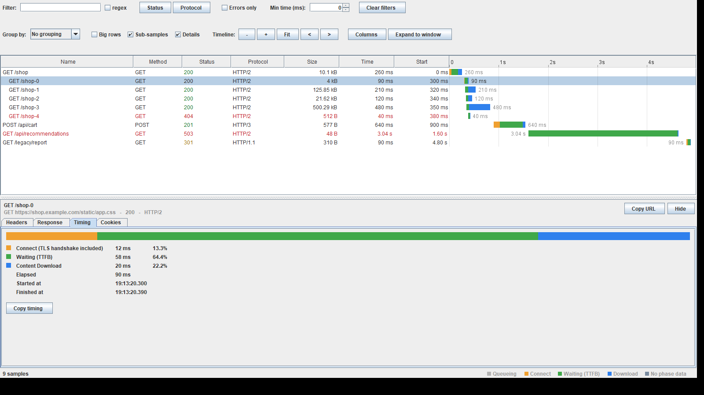
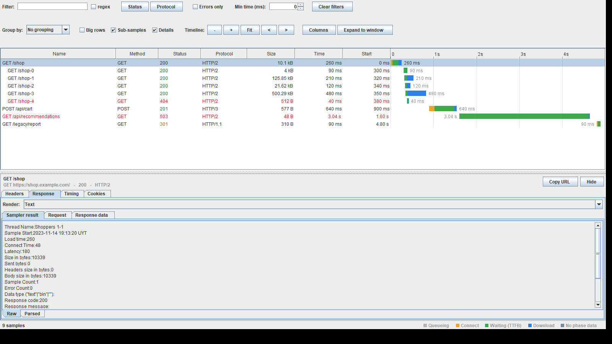
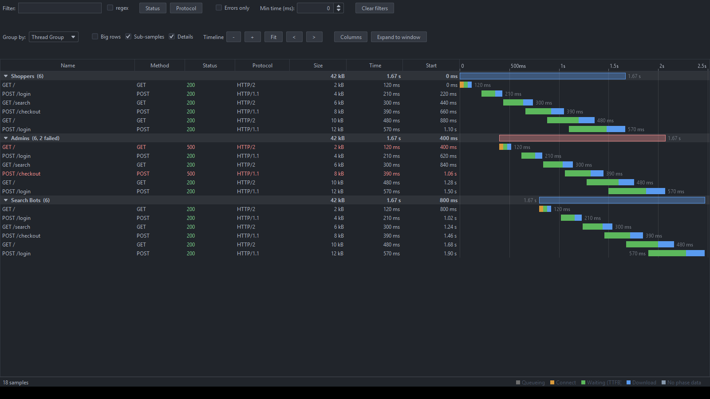

# Waterfall Viewer

A JMeter listener that draws a run the way a browser's Network panel draws a page load: a table of
samples on the left, a time-aligned waterfall of coloured phase bars on the right, and a DevTools
style details panel for whichever request you click.

It is meant as a replacement for **View Results Tree** when the question is *why was this slow*
rather than *what did this return*, and it keeps everything View Results Tree gives you for the
second question too.

- [What it shows](#what-it-shows)
- [Installation](#installation)
- [Using it on a live run](#using-it-on-a-live-run)
- [Loading a .jtl file](#loading-a-jtl-file)
- [The expanded window](#the-expanded-window)
- [Reading the bars](#reading-the-bars)
- [The details panel](#the-details-panel)
- [Filtering, grouping, zooming](#filtering-grouping-zooming)
- [Performance and memory](#performance-and-memory)
- [Properties](#properties)
- [What each data source can and cannot tell you](#what-each-data-source-can-and-cannot-tell-you)
- [Reviewing the UI: the screenshot harness](#reviewing-the-ui-the-screenshot-harness)


---

## What it shows

| Column | Meaning |
|---|---|
| **Name** | The sample label. Sub-samples (embedded resources, redirect hops, transaction children) are indented under their parent. |
| **Method** | `GET`, `POST`, … Blank for a sampler with no HTTP method. |
| **Status** | Response code, coloured: green for 2xx, amber for 3xx, red for 4xx/5xx, red for a non-numeric code on a failed sample. |
| **Protocol** | `HTTP/1.0`, `HTTP/1.1`, `HTTP/2`, `HTTP/3`, read from the response status line. |
| **Type** | Response content subtype (`json`, `html`, `png`, …). Hidden by default. |
| **Size** | Bytes received, headers included. |
| **Time** | Elapsed time. |
| **Start** | Start time relative to the first sample on screen. |
| **Thread** | Thread name. Hidden by default. |
| **Waterfall** | The bars, with the time ruler above them. |

Right-click is not needed for the column set: use the **Columns** button in the toolbar.

Any `SampleResult` with a **start time and an elapsed time** gets a bar — HTTP, JDBC, JMS, gRPC,
GraphQL, a JSR223 sampler, anything. Connect time, latency, protocol, headers and body are
*enrichment*: when a sampler reports them the bar is split into phases and the details panel fills
up; when it does not, you still get a correctly placed bar and the panel says what is missing.

---

## Installation

The viewer ships inside the plugin jar, so if the plugin is installed you already have it.

**With Plugins Manager** — install or update *BlazeMeter HTTP Plugin* the usual way
(see the [main README](../README.md#readme-install-plugins-manager)).

**Manually** — drop `jmeter-bzm-http2-<version>.jar` into `<JMETER_HOME>/lib/ext` and restart
JMeter.

**Building it yourself:**

```bash
mvn clean package
```

The jar lands in `target/`. Copy it to `<JMETER_HOME>/lib/ext` and restart JMeter.

**Verify:** the listener appears as **bzm - Waterfall Viewer** under
**Add → Listener** on any Thread Group or Test Plan node. If it is missing, the plugin jar is not on
JMeter's `lib/ext` path — check `jmeter.log` for a class-loading error.

---

## Using it on a live run

1. Right-click a Thread Group (or the Test Plan) → **Add → Listener → bzm - Waterfall Viewer**.
2. Start the test.

Rows appear as samples complete, and the timeline grows with the run. While you have not zoomed,
the axis follows that growth so the whole run stays on screen; once you zoom or pan, the view stays
where you put it so an arriving sample cannot yank the region you are inspecting.

**Clear** (the broom, or Ctrl+E) empties the viewer and resets the filters.

A few things worth knowing for a live run:

- Samples are handed over on the sampler threads and only *queued* there. The table is updated four
  times a second on the UI thread, in bounded batches. A listener that made a test thread wait would
  distort the very numbers it is reporting.
- The **Sub-samples** checkbox controls whether embedded resources, redirect hops and transaction
  children get rows of their own. It applies to samples arriving from then on — turn it off before
  the run, not during it.
- Leave the viewer's window open or closed as you like; data collection does not depend on it being
  the visible tree node.

---

## Loading a .jtl file

The viewer uses JMeter's own result file panel, so it reads both flavours of `.jtl` — CSV and XML —
including files produced by a non-GUI run:

```bash
jmeter -n -t plan.jmx -l results.jtl
```

1. Add **bzm - Waterfall Viewer** to the plan (it does not need to be the plan that produced the
   file).
2. In **Write results to file / Read from file**, **Browse** to the `.jtl`.

The file is parsed on a background thread, so a large result file does not freeze JMeter while it
loads; rows stream in as they are read.

**To get a full waterfall out of a non-GUI run**, the run has to save the columns the viewer draws
with. In `user.properties`:

```properties
# Timings: connect and latency are what split a bar into phases
jmeter.save.saveservice.connect_time=true
jmeter.save.saveservice.latency=true
jmeter.save.saveservice.idle_time=true

# timeStamp is the START of the sample, not the end (this is JMeter's own default in
# jmeter.properties, but the built-in fallback is false — see the note below)
sampleresult.timestamp.start=true

# XML output, if you want protocol, headers and bodies in the details panel
jmeter.save.saveservice.output_format=xml
jmeter.save.saveservice.response_headers=true
jmeter.save.saveservice.requestHeaders=true
jmeter.save.saveservice.response_data=true
jmeter.save.saveservice.samplerData=true
jmeter.save.saveservice.url=true
```

> **`sampleresult.timestamp.start` matters more here than anywhere else.** Whether a JTL's
> `timeStamp` column is the *start* or the *end* of a sample is decided by this property in the
> JMeter that **reads** the file, not the one that wrote it. If the two disagree, every bar is
> offset by its own duration — the picture stays internally consistent and is quietly wrong.
> JMeter's shipped `jmeter.properties` sets it to `true`; keep it that way on both ends.

---

## The expanded window

A waterfall is only as useful as it is wide: a bar three pixels across cannot tell you which phase
dominated it. JMeter's listener panel is a fraction of a screen with the test plan tree beside it, so
the viewer can move out of it.

- **Expand to window** (toolbar) opens the waterfall in a **maximised window of its own**.
- **F11** in that window toggles **fullscreen**; **Escape** leaves fullscreen.
- **Return to panel**, or just closing the window, puts it back.

Expanding *moves* the view rather than cloning it: same samples, same filters, same zoom level, same
selection, either way. The listener panel shows a note while the window is open so it is never
unclear where the data went.

---

## Reading the bars

Each bar spans the sample's real wall-clock extent on a shared time axis, split into phases in the
order they happen:

| Colour | Phase | Where it comes from |
|---|---|---|
| ⬜ Grey | **Queueing / Idle** | `idleTime` — wall-clock time the sample did not measure, such as the pauses between a transaction controller's children. Zero for a plain request. |
| 🟧 Orange | **Connect** | `connectTime`. Absent on a reused connection, which is the normal case after the first request to a host. On an HTTPS request this figure includes the TLS handshake, and the Timing tab labels it as such. |
| 🟩 Green | **Waiting (TTFB)** | `latency − connectTime` — the server thinking. |
| 🟦 Blue | **Content Download** | `elapsed − latency` — reading the body off the wire. |
| ▪ Slate | **No phase data** | The whole elapsed time as one segment, for a sample that reported neither a connect time nor a latency. |

These are exactly the phases JMeter measures, and no others. In particular **there is no separate
SSL/TLS phase**: `SampleResult.connectTime` covers the whole connection setup with the handshake
inside it, and neither JTL format has a column for the handshake alone. A browser can show a purple
TLS band because it instrumented its own socket; JMeter does not report that number, so the viewer
does not draw a band for it.

The slate bar is the one with no browser equivalent, and it is deliberate too: a sampler that never
measured a connect time gets an honest single bar rather than a fabricated split.

The elapsed time is written next to each bar when there is room. **Hover** a bar for a tooltip with
the label, URL, status, protocol, size, relative start and the full phase breakdown.

A bar too short to fill a pixel is widened to a marker, because a 3 ms request in a five-minute run
would otherwise be invisible and read as *no sample here*.

---

## The details panel

Click any row. The panel below the table describes that sample across four tabs, and the split
between them is a deliberate division of labour with JMeter.

**Response** is JMeter's own machinery, unmodified. **Headers**, **Timing** and **Cookies** are the
things a waterfall needs that View Results Tree has no equivalent for.

Only the visible tab does any work, so clicking down a list of megabyte responses does not decode
four copies of each body. Every tab that has nothing to show says *why* instead of going blank.

### Response

This tab **is** View Results Tree's right-hand side, hosted inside the waterfall.

At the top is the same **Render:** selector, listing every renderer this JMeter has, in the order
set by the standard `view.results.tree.renderers_order` property, defaulting to the same
`RenderAsText`. Below it are the renderer's own tabs — *Sampler result*, *Request*, *Response data*
— with JMeter's request views, its response metadata table and its search box.

That means the presentation of a response body is decided the way JMeter decides it: dynamically,
by content type, through the `ResultRenderer` interface.

| Renderer | What it handles |
|---|---|
| **Text** | Plain text, and the default. |
| **HTML** / **HTML Source Formatted** / **HTML (download resources)** | Markup, rendered or as formatted source. |
| **JSON** | Pretty-printed and navigable. |
| **XML** | As a collapsible DOM tree. |
| **Document** | Anything Apache Tika can read — PDF, Word, Excel, OpenDocument — extracted to text. |
| **Regexp Tester**, **CSS/JQuery Tester**, **XPath Tester**, **XPath2 Tester**, **JSON Path Tester**, **JMESPath Tester** | Try an extractor expression against this very response. |
| **Browser** | A real browser view, when JavaFX is present. |
| *anything else* | A third-party renderer dropped into `lib/ext` shows up here on its own. |

Images are handled the same way JMeter handles them: a sample whose data type is not text goes down
JMeter's image path rather than its text path.

**Nothing in this tab looks at a content type itself.** Reimplementing JMeter's MIME handling would
have meant a second, worse copy of it — one that would not know about Tika-backed document
extraction, would not pick up a renderer a plugin installed, and would drift from View Results Tree
at every JMeter release. The response-viewing behaviour here is JMeter's, and it improves when
JMeter's does.

> The renderer list is discovered by scanning the classpath, which is slow, so it happens once per
> JMeter session and only the first time a response is actually shown — never while JMeter is
> building its Add menu.

### Headers

The DevTools-style header view, in three sections in the order the questions get asked:

- **General** — URL, method, status code and message, protocol, label, thread, elapsed, response
  size broken into headers and body, request size, success.
- **Request Headers**
- **Response Headers**

A **Filter headers** box narrows all three at once — the way to find one header in a request that
carries thirty. **Copy request headers** and **Copy response headers** put the raw blocks on the
clipboard.

JMeter shows the same headers, but split across its *Request* and *Response data* tabs and in
separate tables. This tab exists for the case where you want them together and searchable in one
place; the Response tab remains the authority on the exact bytes.

### Timing

Every phase the sample reported, as a stacked bar and as a table of durations and shares of the
span, plus the absolute start and finish times and a **Copy timing** button.

This is the tab with no View Results Tree counterpart, and the reason the listener exists. It is
also where the limits of the data are stated rather than papered over:

- A sample with no connect time and no latency gets one row saying its elapsed time cannot be split.
- On an HTTPS request the connect row is labelled **Connect (TLS handshake included)**, because that
  is what JMeter's `connectTime` is.
- Idle time is explained where it appears.

### Cookies

**Request cookies** — from JMeter's own cookie field when the Cookie Manager filled it in, and from
the `Cookie` request header otherwise, because a request built with an explicit Header Manager has
one and not the other.

**Response cookies** — one row per `Set-Cookie`, split into Name, Value, Domain, Path, Expires,
Max-Age, HttpOnly, Secure and SameSite. That breakdown is where the answers to *why did my session
not stick* live: a wrong path, a domain that does not match, an expiry in the past.
---

## Filtering, grouping, zooming

**Filters** (first toolbar row), all combined with AND:

| Control | Effect |
|---|---|
| **Filter** | Substring match on label or URL. Tick **regex** to treat it as a regular expression; the field turns red while an expression does not compile, and filters nothing rather than everything. |
| **Status** | A menu of status classes (`2xx`…`5xx`, plus *Other / non-numeric*). Nothing ticked means everything passes. |
| **Protocol** | Built from the protocols actually seen. Everything seen stays available to filter on, so narrowing to HTTP/2 does not remove HTTP/1.1 from the list. |
| **Errors only** | Hide successful samples. |
| **Min time (ms)** | Hide anything faster — the fastest way to isolate the slow tail. |
| **Clear filters** | Back to pass-through. |

**View options** (second row):

| Control | Effect |
|---|---|
| **Group by** | *No grouping*, *Thread Group* or *Label*. Group headings are collapsible and carry the group's sample count, failure count, total bytes and overall span as a hollow envelope bar. Grouping by thread group answers *what was this virtual user doing*; grouping by label answers *how did this request behave across the run*. |
| **Big rows** | Taller rows with thicker bars. |
| **Sub-samples** | Whether embedded resources, redirect hops and transaction children get their own rows. |
| **Details** | Show or hide the details panel. |
| **Columns** | Column visibility. |
| **Timeline** | `−` `+` zoom, **Fit**, `<` `>` pan. |

**Timeline gestures:**

| Gesture | Effect |
|---|---|
| **Ctrl + mouse wheel** over the bars | Zoom about the pointer — the instant under the cursor stays under the cursor. |
| **Shift + mouse wheel** over the bars | Pan. |
| **Middle-drag**, or **Shift + drag**, over the bars | Pan. |
| **Drag across the ruler** | Zoom to the dragged range. |
| **Double-click the ruler** | Fit the whole timeline. |
| **Ctrl +** / **Ctrl −** / **Ctrl 0** | Zoom in / out / fit. |

The plain mouse wheel and plain clicks are left alone: a waterfall that hijacked the wheel would be
useless for its main job, which is scrolling a long list of requests.

**Sorting:** click a column header — first click ascending, second descending, third back to arrival
order. With grouping on, sorting applies within each group; groups stay in timeline order.

**Copy:** Ctrl+C copies the selected row's visible columns as tab-separated text with headings.

---

## Performance and memory

Row virtualisation is not an option here, it is the design. The bars are the table's **last column**,
not a separate component synchronised with it, so JTable's own virtualisation covers them: only the
rows on screen are ever painted, whether the model holds fifty samples or fifty thousand. Renderers
are shared instances that allocate nothing per row.

Two more things keep a long run affordable:

- **Incremental updates.** While nothing is grouped and no column is sorted — the state the viewer
  is in during a run — arriving samples are appended and only the new rows are announced. Any other
  state rebuilds the row list, which only happens when you change something.
- **A retention bound.** Each row keeps a reference to its `SampleResult` so the details panel can
  show headers and bodies, and that reference is the memory ceiling of the whole viewer. The oldest
  samples are evicted past **`blazemeter.waterfall.maxSamples`** (default **50 000**), and the status
  line says how many were dropped so a partial timeline never looks complete.

If you need every sample of a very long run, raise the bound and give the JVM the heap for it — or
write a `.jtl` during the run and open that afterwards, which costs no memory during the test at
all.

---

## Properties

Set these in `user.properties` and restart JMeter.

| Property | Description | Default |
|---|---|---:|
| **blazemeter.waterfall.maxSamples** | Samples retained before the oldest are evicted. `-1` for no limit — every sample and its response body then stays in memory for the life of the viewer. | 50000 |

The viewer adds only that one, because the Response tab is JMeter's own renderer stack and obeys
JMeter's own settings. The ones worth knowing:

| Property | Effect on the Response tab |
|---|---|
| **view.results.tree.renderers_order** | Order of the renderers in the **Render:** selector, and therefore which appears first. |
| **view.results.tree.max_size** | Response bytes a renderer will show before truncating. |
| **view.results.tree.max_line_size** / **soft_wrap_line_size** | Line-length handling in the text views. |

---

## What each data source can and cannot tell you

A waterfall is only as good as the timings behind it, and not every field exists everywhere. The
short version:

**A live run** gives you everything the sampler reports. `bzm - HTTP Sampler` and JMeter's own HTTP
Request both report connect time and latency, so bars are fully split; the protocol comes from the
response status line, and headers and bodies are in memory.

**A CSV `.jtl`** gives you timings and status, but not the URL or the protocol:

- The **URL column is not restored by JMeter's CSV reader** — it is written and then skipped on the
  way back in. Nothing the viewer can do; the Name column still shows the label.
- The **protocol** lives in the response status line, which the CSV format has no column for.

**An XML `.jtl`** can carry response headers, request headers and bodies, so a file saved with
`output_format=xml` and the data columns enabled gives you the protocol column and a fully populated
details panel.

**No data source anywhere gives a separate TLS handshake time.** `SampleResult.connectTime` is the
whole connection setup with the handshake inside it, there is no API to ask for the handshake alone,
and neither JTL format has a column for it. So the viewer has no TLS phase at all: the connect bar is
one orange segment, and the Timing tab labels it *Connect (TLS handshake included)* on an HTTPS
request. Showing a purple band that was always empty, or an `SSL: 0 ms` row, would have been worse
than not showing one.

---

## Reviewing the UI: the screenshot harness

`WaterfallScreenshotHarness` (in the test sources) renders the viewer to PNG files. It is not a test
and the build does not run it; it exists because the defects a waterfall actually suffers from are
not the kind a pixel assertion catches. A toolbar that pushes its own controls off the right edge, a
Size column too narrow for `500.29 kB`, a bar flush against the edge of its column, a failed row
whose colour leaks into every row below it — all of those were found by generating images and looking
at them, and all of them pass every unit test.

```bash
mvn test-compile
java -Djmeter.home="$JMETER_HOME" \
  -cp "target/test-classes:target/classes:$JMETER_HOME/lib/*:$JMETER_HOME/lib/ext/*" \
  com.blazemeter.jmeter.http2.visualizers.waterfall.WaterfallScreenshotHarness /tmp/shots
```

Add `dark` as a second argument to render with Darklaf, the look and feel JMeter ships for its dark
theme. Pointing `-Djmeter.home` at a real installation is what makes the Response tab show the
genuine renderer set, since JMeter's own component jars live under `lib/ext`.

The thirteen scenarios cover a browser-like page load with embedded resources, the narrow embedded
view, each details tab, grouping by thread group, errors-only filtering, big rows, a zoomed timeline,
samples with no phase data, an empty viewer, a long run, and a width narrow enough to force the
toolbar to wrap. Layout needs a display — Swing will not lay out a detached component tree — but the
frames are packed and never shown, so nothing appears on screen.






